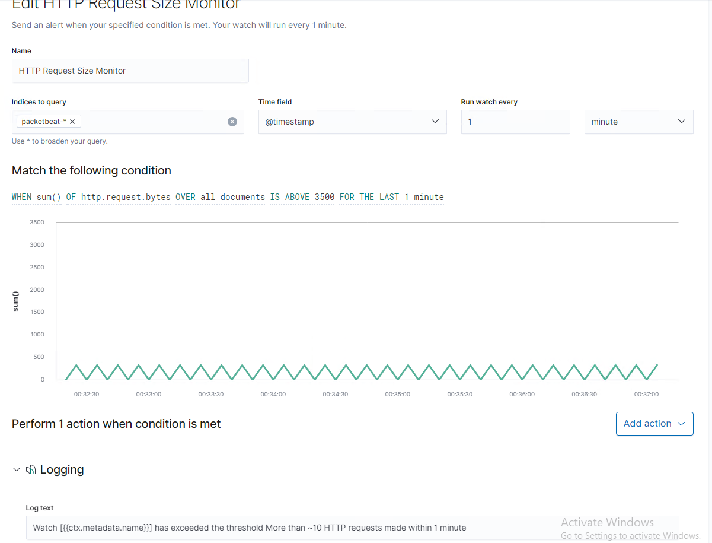

# Blue Team: Summary of Operations

## Table of Contents
- Network Topology
- Description of Targets
- Monitoring the Targets
- Patterns of Traffic & Behavior
- Suggestions for Going Further

### Network Topology
The following machines were identified on the network:

- Kali
  - Operating System: Debian Kali 5.4.0
  - Purpose: The Penetration Tester
  - IP Address: 192.168.1.90

- ELK
  - Operating System: Ubuntu 18.04
  - Purpose: The ELK (Elasticsearch and Kibana) Stack
  - IP Address: 192.168.1.100

- Target 1
  - Operating System: Debian GNU/Linux 8
  - Purpose: The WordPress Host
  - IP Address: 192.168.1.110

- Capstone
  - Operating System: Ubuntu 18.04
  - Purpose: The Vulnerable Web Server
  - IP Address: 192.168.1.105

### Description of Targets

The target of this attack was: `Target 1` (192.168.1.110).

Target 1 is an Apache web server and has SSH enabled, so ports 80 and 22 are possible ports of entry for attackers. As such, the following alerts have been implemented:

### Monitoring the Targets

Traffic to these services should be carefully monitored. To this end, we have implemented the alerts below:

#### HTTP Request Size Monitor

HTTP Request Size Monitor is implemented as follows:
`WHEN sum() OF http.request.bytes OVER all documents IS ABOVE 3500 FOR THE LAST 1 minute`
  - **Metric**: WHEN sum() OF http.request.bytes OVER all documents
  - **Threshold**: IS ABOVE 3500 FOR THE LAST 1 minute
  - **Vulnerability Mitigated**: DDOS Attacks or XSS
  - **Reliability**: The alert has a low chance of creating false positives, so it has a higher reliability. It is still possible that a large, legitimate HTTP request could set off a false positive.

#### Excessive HTTP Errors
Excessive HTTP Errors is implemented as follows:
`WHEN count() GROUPED OVER top 5 'http.response.status_code' IS ABOVE 400 FOR THE LAST 5 minutes`
  - **Metric**: WHEN count() GROUPED OVER top 5 'http.response.status_code'
  - **Threshold**: IS ABOVE 400 FOR THE LAST 5 minutes
  - **Vulnerability Mitigated**: Brute Force Attacks
  - **Reliability**: This alert has a high reliability. An excessive amount of HTTP error codes within a short amount of time is a clear sign of brute force or enumeration attempts.

#### PHOTO

#### CPU Usage Monitor
CPU Usage Monitor is implemented as follows:
`WHEN max() OF system.process.cpu.total.pct OVER all documents IS ABOVE 0.5 FOR THE LAST 5 minutes
  - **Metric**: WHEN max() OF system.process.cpu.total.pct OVER all documents
  - **Threshold**: IS ABOVE 0.5 FOR THE LAST 5 minutes
  - **Vulnerability Mitigated**: Malware
  - **Reliability**: This has a relatively high reliability. A high percentage of CPU usage can be a false positive based off of programs running, but it is highly reliable in the case that there is malware.

#### PHOTO

### Suggestions for Going Further

The logs and alerts generated during the assessment suggest that this network is susceptible to several active threats, identified by the alerts above. In addition to watching for occurrences of such threats, the network should be hardened against them. The Blue Team suggests that IT implement the fixes below to protect the network:
- HTTP Request Size Monitor
  - **Patch**: HTTP request limits should be implemented on the server along with input validation on forms.
  - **Why It Works**: Limiting HTTP request sizes can help to limit DDOS or Code Injection attempts. Input validation helps by rejecting attempts to input code into the server through forms on a site.
- Excessive HTTP Errors
  - **Patch**:  Wordpress should be updated regularly with `apt-get update` and `apt-get upgrade`. Plugins should also be installed.
  - **Why It Works**: Updating can easily fix and patch the program for known vulnerabilities. Installing a security plugin for Wordpress can scan for common threats, provide firewall protection, and can sometimes offer malware cleanup for an infected Wordpress site.
- Vulnerability 3
  - **Patch**: An antivirus can be used to harden against malware and viruses. An Intrusion Detection system can also help.
  - **Why It Works**: A good antivirus software can detect and remove most threats if they are present. Intrusion Detection systems allows for monitoring and analyzing of network packets. 
